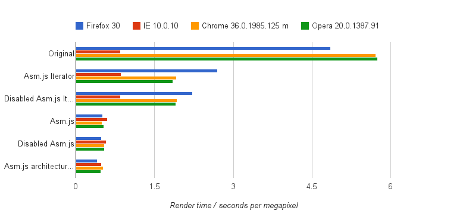

mandelbrot
==========

Explore the Mandelbrot Set with the HTML5 canvas element, web workers, and asm.js.

Try it out at [http://github.andrewt.net/mandelbrot](http://github.andrewt.net/mandelbrot)

##Performance stats

Opera is, I think, Chromium-based these days, which explains its similarity to Chrome in performance.

The colour of each pixel is given by the number of iterations of a simple bit of arithmetic on its coordinates required to make the coordinates far away from (0, 0).

* The top block represents the original implementation.
* The second block calls an [http://asmjs.org/](asm.js) module to perform each pixel's iteration.
* The third block is the same as the first, but with asm.js disabled.
* The fourth block uses an asm.js module to calculate the entire image, although some colour pre-cacheing is done and the colour selection is simpler (although that's what's pre-cached so it's not especially relevant that its simplified).
* The fifth block is the same as the fourth, but with asm.js disabled.
* The last block uses the architecture and cacheing strategy from the full asm.js version, but without any of the `>>2` and `|0` nonsense that asm.js requires.

It seems that using asm.js doesn't especially increase performance in this case, but that it does force me to write more optimal code in the first place. Even in Firefox, home of asm.js, the best performance is obtained when not using asm.js.

The weirdest thing to me is that IE is so blazingly fast on the original code, but how little it improves when moving to the faster asm.js-inspired code. I don't know what to expect native performance to look like on this graph (and I can't include Safari fairly as I tested the rest on the same Windows PC).