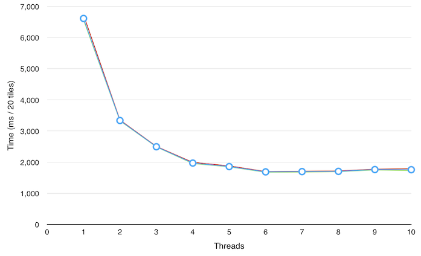

mandelbrot
==========

Explore the Mandelbrot Set, with absurd amounts of modern web technology!

The image is generated in your browser. All processing is done off the main thread by a web worker. The colour of each pixel is given by the number of iterations of a simple bit of arithmetic on its coordinates required to make the coordinates far away from (0, 0).

## Versions

### Original

The original version is at [http://github.andrewt.net/mandelbrot/original](http://github.andrewt.net/mandelbrot/original). This version lets you zoom in and out, and records your history as you go. It uses the Javascript History API so you should be able to use the back and forwards buttons.

### Leaflet.js

The new version is at [http://github.andrewt.net/mandelbrot/leaflet](http://github.andrewt.net/mandelbrot/leaflet). This version uses Leaflet.js to give a Google Maps-style experience. Because Leaflet operates with many small 'tiles' rather than one large image, multiple workers are spun up to boost performance on multi-code machines (see below).

## Performance stats

### Browser and architecture

I ran some stats a while ago to see how fast the code was with different optimisations, including testing asm.js — a subset of Javascript which Firefox can compile into native code and run absurdly fast.

Opera is, I think, Chromium-based these days, which explains its similarity to Chrome in performance.

* The top block represents the original implementation.
* The second block calls an [http://asmjs.org/](asm.js) module to perform each pixel's iteration.
* The third block is the same as the first, but with asm.js disabled.
* The fourth block uses an asm.js module to calculate the entire image, although some colour pre-cacheing is done and the colour selection is simpler (although that's what's pre-cached so it's not especially relevant that its simplified).
* The fifth block is the same as the fourth, but with asm.js disabled.
* The last block uses the architecture and cacheing strategy from the full asm.js version, but without any of the `>>2` and `|0` nonsense that asm.js requires.

It seems that using asm.js doesn't especially increase performance in this case, but that it does force me to write more optimal code in the first place. Even in Firefox, home of asm.js, the best performance is obtained when not using asm.js.

The weirdest thing to me is that IE is so blazingly fast on the original code, but how little it improves when moving to the faster asm.js-inspired code. I don't know what to expect native performance to look like on this graph (and I can't include Safari fairly as I tested the rest on the same Windows PC).

### Thread count

This was done using the Leaflet.js version of this project, using Firefox on a MacBook Pro 11,3 running OSX 10.9.5. It rendered the central 20 tiles at default zoom in a 940 × 821 window. I did five trials for each thread count — the blue line is the average. There are red and green maximum and minumum lines but you can't really see them.

It seems like the optimum performance is somewhere around 6 — 8 threads. I've set the default to six threads, but you can change it by adding (say) `#threads=4` to the URL. (This only works in the Leaflet version.)